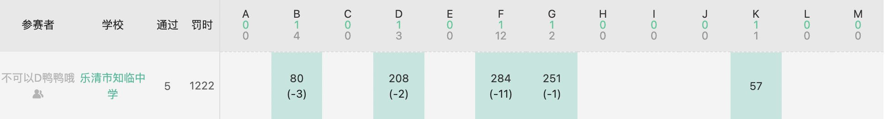

# ICPC 2022 Kunming

## 流水账

[比赛的链接](https://ac.nowcoder.com/acm/contest/41004?&headNav=www)



开场 pac 从头开始开题， LLL 从中间开始开题， gym 倒着开题。

pac 发现 B 题可做，大概是一个状压期望dp，但是感觉不是签到所以就放着。

gym 发现 K 题是签到题，但是并没有很好的想法。

LLL 和 gym 讨论出了 K 的做法，然后写掉了它。`K1Y57`

pac 开始写 B ，然后 Wa 了。看了很久才发现是没有注意到多case。然后写掉了它 `B4Y80`。

LLL 会做 F 了，于是开始写，但是交上去之后一直又 Wa 又 Tle 的。

gym 和 pac 讲了 G 的题意然后开始一起想，但是不会。主要是一直试图求出每一个物品在 $m$ 轮之后位于第 $i$ 位的概率。猜了一些结论但是是错的，暴力跑出了样例中的概率，但是并没有办法推出式子。尝试使用rand()模拟题目的过程1000次取平均值，但是准确度并不是很高。

LLL 放弃了 F， pac 开始试图改 F，然后结局是一样的。

LLL 和 gym 想到了 D 的构造方法，写完之后 Wa 了，发现是 0 的情况没有构造好，然后构造了一个假的，稍微改了一下好了。`D2Y208`

gym 想到考虑一个物品对另一个物品对贡献，在 LLL 和 pac 的努力下，终于写出了极其简单的式子，但是没有注意long double输入输出的问题挂了一发（以后要注意测一下样例）。`G2Y251`

本来打算下班了，但是还是想稍微救救 F，gym 提出只需要考虑长度为 2 和 3 的路径就好了，然后感觉很真，最后终于写完了。 `F12Y284`。 F 中间还 RE 了一次，原因是 for 循环中对于一个`std::vector`，使用了`size()` 作为边界值，但是不知道为什么会这样：

将

``` c++
for(int i = qx.size() - 1; i >= qx.size() - 2; i--);
```

改为

``` c++
int siz = qx.size();
for(int i = siz - 1; i >= siz - 2; i--);
```

竟然就好了……

**一点总结**：首先今天似乎有点划水，没有什么训练状态，不过也不算完全摆烂，作为新学期的第一次训练我觉得还算是成功的。希望以后继续努力，然后尽快找回训练状态。（嗯，以后晚饭提前吃好qwq）
