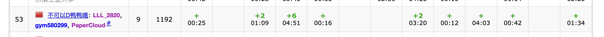

# The 15th Chinese Northeast Collegiate Programming Contest

## 流水账

[比赛的链接](https://codeforces.com/gym/103145)

比赛开始后还没有找到比赛的链接，耽误了几分钟。

开场马上就有人写 E ，于是 pac 开始看，但是发现英语不行，于是让给了 LLL 看，gym 开始看 I ，想到了做法之后让 LLL 来写。 `I1Y12`

pac 看懂了 E，然后把做法告诉了 LLL。 `E1Y16`

pac 看完了 A，稍微推了一下式子，然后写掉了它。 `A1Y25`

pac 写 A 的时候，gym 会了 K，LLL 会了 C，gym 写 K 的时候，LLL 又会了 M，pac 会了 D 和 J。一下子手上有了好几道题目。

gym K 样例调了一会，在静态调试的时候 LLL 开始写 C。`K1Y42`

LLL C一开始没有模拟好样例，导致状态转移错了。没有加特判以及有地方想错了。`C3Y69`

LLL 写 M 的时候，发现对 `std::string` 的一些用法不太熟练。`M1Y94` 。期间 gym 和 pac 看完了 H，有了一些初步的想法。

pac 开始写 D ，然后 TLE 了，没有发现查询部分的复杂度是不对的。

gym 开始写 H ，Wa2，开始调。

LLL 发现了 D 复杂度不对，改完之后变成了 Wa2 。

gym 对特殊点进行了讨论，过了 H。`H3Y200`

gym 发现 D 线段树初始化写错了，改完之后还是 Wa2。

pac 开始写 J。`J1Y243`

pac 改了取模，防止出现负数。最后竟然过了。 `D7Y291`

## 一点总结

签到其实不够顺利，以后还是尽量在比赛开始前准备好东西。

其实都是签到题。

D 写的太慢了，导致最后没有时间写 B。但是 B 真的太长了。

而且这个时候手上囤了太多的题，导致也不是很敢去开新的题。

以后不能让一道题贯穿始终，要么重构，要么先放着去做其他题。
